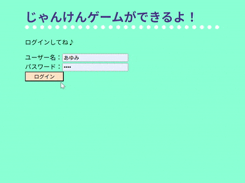

# じゃんけんゲーム (Webアプリ)

SSの基本学習として作成した、 
Web上で動くじゃんけんゲームです。 
   

[概要](#概要)｜
[できる事](#できる事)｜
[使用環境と技術](#使用環境と技術)｜
[実行イメージ](#実行イメージ)｜
[工夫した点](#工夫した点)｜
[苦労や学び](#苦労や学び)｜
[その他](#その他)
 

## 概要 
・SS学習開始約1か月後にEclipseで作成したプログラムです。 
　学習用プログラムをもとに、改変しました。 
・理解を深める目的として作成した、 
　Web上で動作するじゃんけんゲームです。 
・Java（servlet、model）とJSPを中心に、 
　HTML / CSS / JavaScript を組み合わせ、 
　画面操作とサーバ側処理の連携を意識して実装しました。 
　（HTML＆CSS学習約1カ月、JavaScript学習1カ月） 
　　　> [▲ トップへ戻る](#top)

## できる事 
・ コンピュータとのじゃんけん 
1. ログイン（簡易的なID・パスワード認証） 
1. じゃんけん選択時、カーソル変更 
1. グー、チョキ、パーのボタン選択で勝負。 
1. 勝敗結果を最新順で画面に表示 
1. ログアウト時、確認ダイアログ表示 
　> [▲ トップへ戻る](#top)

## 使用環境と技術 
・言語等：Java（servlet、model）、JSP、CSS、JavaScript 
・実行環境：Web 
・使用技術： 
　フォーム送信による値の受け渡し・取得 
　セッションスコープによる、ログイン状態管理 
　Math.randomによる乱数生成 
　if文 
　for文 
　リスト 
　画面表示制御 
　ログアウト時、セッションスコープ削除 
　　　> [▲ トップへ戻る](#top)

## 実行イメージ 
   
　　　> [▲ トップへ戻る](#top)
 
## 工夫した点 
・選択時に視覚的に分かるよう、 
　JavaScriptでマウスオーバー時に「カーソルを画像に」変更。 
　JavaScriptで処理を実装することで、 
　ID取得やカーソルが重なった時・外れた時のスタイル変更処理の 
　理解を深めることを意識しました。 

・じゃんけん処理については、制作効率を考え、　 
 「コマンドプロンプト上で動くじゃんけんプログラム」をもとにしました。  

・当初はラジオボタンで選択して「対戦！」としてましたが、 
　即座に選択して結果が出るように、ボタン送信（submit）に変更しました。 
　servletでは、name/valueを用いて選択内容を判定。 

・CSSについては、検証として 
　静的インクルードで取り込みました。 

・一つずつ機能を実装しながら、 
　ユーザー視点も考えつつ、改善・試行錯誤しました。 

　　　> [▲ トップへ戻る](#top)

## 苦労や学び 
・実装していくにつれて、「こうだったらいいな」を形にするため、 
　次々と機能を増やしていきました。 
　その時点で学習しているものを活かせるように、 
　アウトプット用の作品として制作しました。 

・苦労して実装した機能の後は、 
　別で学習した、比較的すぐにできる機能を実装したり、見た目を変える事で、 
　モチベーションの維持に努めました。 
 
・JavaScriptについて、 
　保存場所やパスをどうしたらいいのかが分からず悩みました。 
　そのおかげで、調べて実際にどうしたらいいのかが分かり、 
　実体験として経験になったので良かったと思います。 

・エラーが多く発生したり、イメージとの相違はありましたが、 
　一つずつ原因を確認・修正することで、 
　最終的にイメージ通りに動作させることができました。 
　　　> [▲ トップへ戻る](#top)

## その他 
・休憩の合間で少しずつ完成させていきました。 
・同時期に学習していたものを活用し、アウトプットとして作成しました。 
　　　> [▲ トップへ戻る](#top)
